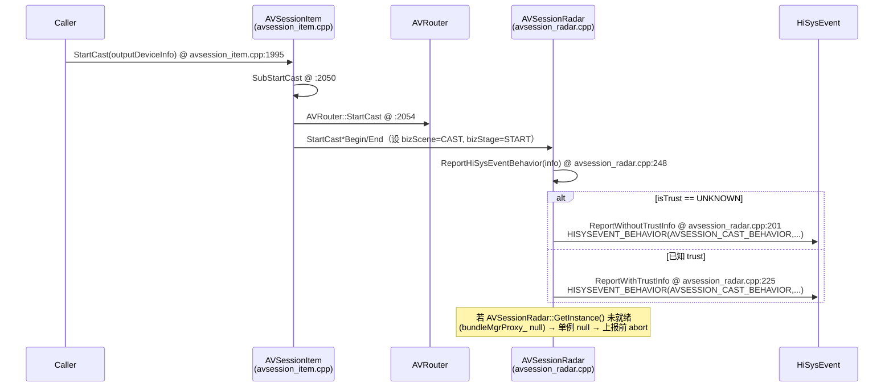

# AVSession 投播（Cast）生命周期

## 业务背景

投播（Cast）把本机音视频会话投到远端设备。端到端步骤：**发现 → 投播 → 连接 → 播放 → 控制 → 停止**。每步由 `AVSessionRadar` 做 HiSysEvent 埋点（`bizScene_`/`bizStage_`/`stageRes_`/`bizState_` 四元组），供质量/故障分析。本页聚焦「投播」步的调用链与错误上报，给 LogScope `/diag` 当 log→code 直达电梯。

## 调用序列

## 逐步错误/上报

| 步骤 | 函数 | 文件:行 | 上报/错误 |
|---|---|---|---|
| 发现 | `AVSessionRadar::StartCastDiscoveryBegin` | utils/src/avsession_radar.cpp:~285 | 设 `bizScene_=CAST_DISCOVERY, bizStage_=START` → `ReportHiSysEventBehavior` |
| 投播(入口) | `AVSessionItem::StartCast` | services/session/server/avsession_item.cpp:1995 | 调 `SubStartCast`；失败 `return SubStartCast(...)` |
| 投播(内) | `AVSessionItem::SubStartCast` | avsession_item.cpp:2050 | 调 `AVRouter::GetInstance().StartCast` @:2054 |
| 上报出口 | `AVSessionRadar::ReportHiSysEventBehavior` | utils/src/avsession_radar.cpp:248 | 统一出口：懒填 local 设备信息 + `GetBundleNameFromUid` + `CheckTriggerMode` + 按 `isTrust_` 分流；`errorCode_==0` 时填 `GetRadarErrorCode(0)` |
| 上报(无 trust) | `AVSessionRadar::ReportWithoutTrustInfo` | avsession_radar.cpp:201 | `HISYSEVENT_BEHAVIOR(AVSESSION_CAST_BEHAVIOR, ...)` 实际写事件 |
| 上报(有 trust) | `AVSessionRadar::ReportWithTrustInfo` | avsession_radar.cpp:225 | 同上，多一个 `IS_TRUST` 字段 |

> **关键陷阱**：`AVSessionRadar::GetInstance()`（avsession_radar.cpp:33）是静态局部变量单例；若投播在服务初始化早期被触发，`bundleMgrProxy_` 尚为 null → `ReportHiSysEventBehavior` 在 `GetBundleNameFromUid` 处失败 → 上报 abort / 抛 `AVSessionRadar null`（err 14900001）。日志里 "AVSessionRadar not registered" 即此。

## 错误目录（log→code 查表）

| 日志信号 | 抛出位置 | 经由 | 步骤 | 函数 |
|---|---|---|---|---|
| `AVSESSION_CAST_BEHAVIOR` 事件 / err `14900001` / "AVSessionRadar not registered" | utils/src/avsession_radar.cpp:201 | ReportHiSysEventBehavior@248 | StartCast | ReportWithoutTrustInfo |
| 同上（trust 路径） | utils/src/avsession_radar.cpp:225 | ReportHiSysEventBehavior@248 | StartCast | ReportWithTrustInfo |
| 统一雷达错误码 `GetRadarErrorCode(err)` | utils/src/avsession_radar.cpp:248 | — | 任意投播步 | ReportHiSysEventBehavior |

> 日志里出现 `AVSESSION_CAST_BEHAVIOR` / `14900001` / "AVSessionRadar null" → 直接查本表 → `avsession_radar.cpp:201/225/248`，code-tracer 可省 grep。

## 下钻锚点

- `services/session/server/avsession_item.cpp:1995` — StartCast 入口
- `services/session/server/avsession_item.cpp:2050` — SubStartCast（调 AVRouter::StartCast）
- `utils/src/avsession_radar.cpp:33` — AVSessionRadar::GetInstance（单例；null 根因）
- `utils/src/avsession_radar.cpp:248` — ReportHiSysEventBehavior（上报统一出口）
- `utils/src/avsession_radar.cpp:201` / `:225` — 实际 HiSysEvent 写点

> 本页由 `flow-writer` 用 CRG `flows` + `query callees_of` + grep `HISYSEVENT_BEHAVIOR` 生成；`last_sync_commit: a4ec47de96f7`。
