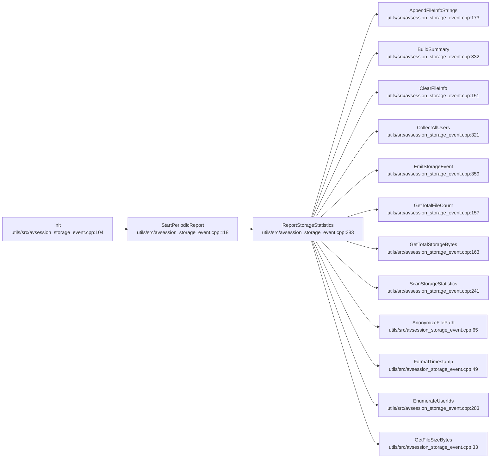
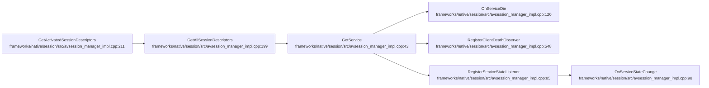
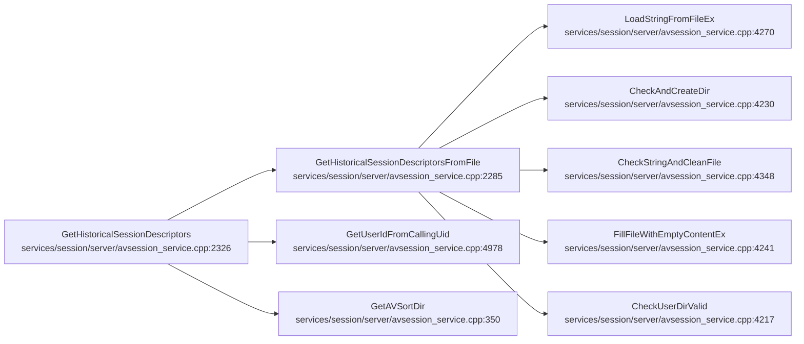
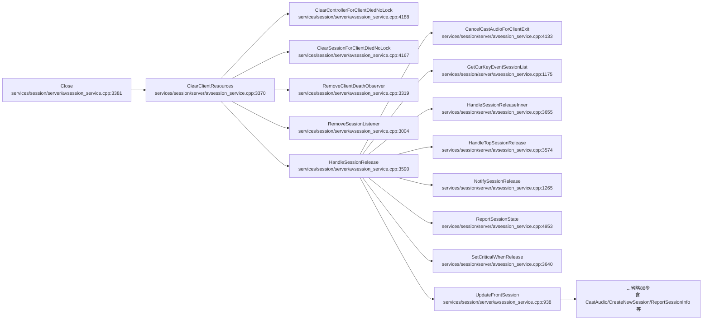
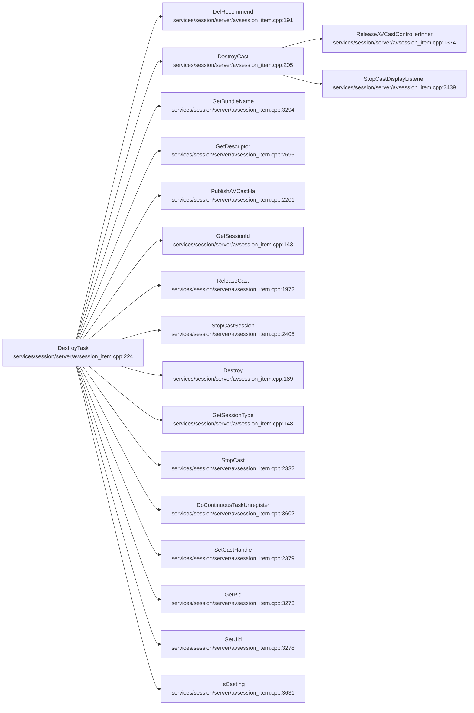
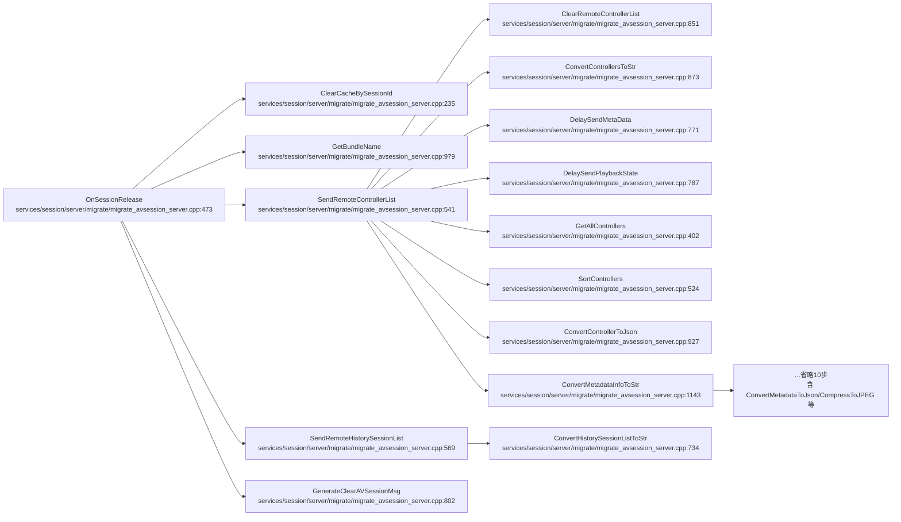
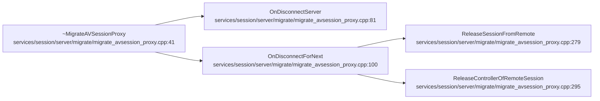
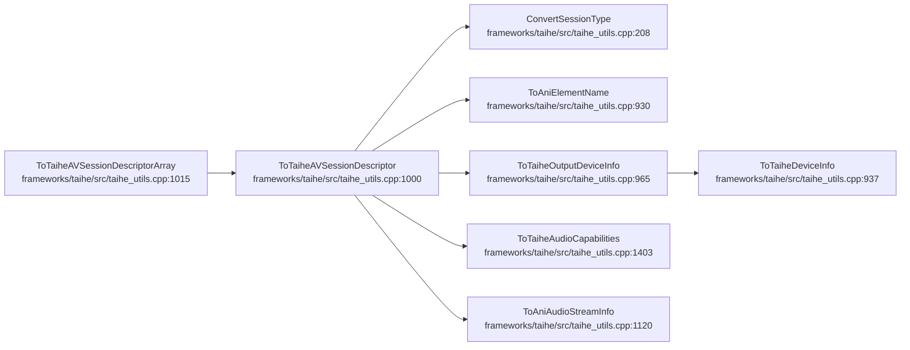

# AVSession 会话生命周期

## 概述
本域覆盖 AVSession 从存储事件初始化、激活/历史会话描述符查询、客户端关闭清理、会话销毁任务、迁移侧会话释放、迁移代理析构到 Taihe 描述符数组转换的完整生命周期。核心入口为 `AVSessionService::Close`（清理客户端资源并级联释放会话）与 `AVSessionItem::DestroyTask`（实际销毁 cast/controller/回调）。典型报错方向：会话创建内存失败（`CONTROL_COMMAND_FAILED`）、renderer 与 avsession 播放状态不一致（`AVSESSION_WRONG_STATE`）、CreateSession/Destroy API 行为上报（`SESSION_API_BEHAVIOR`）、生命周期 create/release 统计（`SESSION_LIFECYCLE_STATISTICS`）。注意：权限拒绝类 `CONTROL_PERMISSION_DENIED` 上报主要在 `avsession_service_stub.cpp`/`GetSessionDescriptorsBySessionId`，不在本域 8 条流的步骤内，此处不纳入主目录。

## 调用序列

### Init (flow 23)

### GetActivatedSessionDescriptors (flow 24)

### GetHistoricalSessionDescriptors (flow 29)

### Close (flow 2, 103 节点, 取前 15 步)

### DestroyTask (flow 26)

### OnSessionRelease (flow 18, 25 节点, 取前 15 步)

### ~MigrateAVSessionProxy (flow 32)

### ToTaiheAVSessionDescriptorArray (flow 9)

## 逐步错误上报

### Close (flow 2) 关键步骤
- **步骤**：`HandleSessionRelease (services/session/server/avsession_service.cpp:3590)`
  - **上报**：`SESSION_LIFECYCLE_STATISTICS`（行为埋点）
  - **错误条件**：会话释放主路径；:3603 调 `ReportSessionState(STATE_RELEASE)` → `AVSessionSysEvent::UpdateState`（实际 `HiSysWriteStatistic` 在 `utils/src/avsession_sysevent.cpp:101`）；:3620 `HISYSEVENT_ADD_LIFE_CYCLE_INFO(... false)` 标记 release，喂给同一统计事件；:3596 `CHECK_AND_RETURN_LOG(sessionItem==nullptr)` 仅 hilog，不写 HiSysEvent。
  - **file:line**：触发 `services/session/server/avsession_service.cpp:3603` 与 `:3620`；统计写入 `utils/src/avsession_sysevent.cpp:101`
- **步骤**：`NotifySessionRelease (services/session/server/avsession_service.cpp:1265)`
  - **上报**：无 HiSysEvent；:1272 `NotifySessionStateChange` 失败、:1276 `AudioSystemManager==nullptr`、:1281 `AVSessionNotifyUpdateNotification` 失败均只 `SLOGE`（hilog E）。
  - **file:line**：`services/session/server/avsession_service.cpp:1272`/`1276`/`1281`
- **步骤**：`ReportSessionState (services/session/server/avsession_service.cpp:4953)`
  - **上报**：`SESSION_LIFECYCLE_STATISTICS`；:4955 session 为 null 时 `SLOGE` 直接 return（不写事件）。
  - **file:line**：`utils/src/avsession_sysevent.cpp:101`
- **步骤**：`CreateSessionInner (services/session/server/avsession_service.cpp:1856)`（Close 流尾部 CastAudioForNewSession 分支可达）
  - **上报**：`CONTROL_COMMAND_FAILED`（FAULT）
  - **错误条件**：:1877 `CreateNewSession` 返回 nullptr（内存分配失败）→ :1883 上报 `ERROR_MSG="avsessionservice createsessioninner create new session failed"`，返回 `ERR_NO_MEMORY`；另 :1860 `IsParamInvalid` 失败返回 `ERR_INVALID_PARAM`、:1869 `AbilityHasSession` 命中返回 `ERR_SESSION_IS_EXIST`（这两条走 `StreamDfxManager::SendAudioErrorEvent`，非 HiSysEvent）；:1893 `HISYSEVENT_ADD_LIFE_CYCLE_INFO(... true)` 标记 create。
  - **file:line**：`services/session/server/avsession_service.cpp:1883`
- **步骤**：`ReportSessionInfo (services/session/server/avsession_service.cpp:1935)`
  - **上报**：`SESSION_API_BEHAVIOR`（BEHAVIOR/CRITICAL，半错误）
  - **错误条件**：CreateSession 结束上报，`API_NAME="CreateSession"`，`ERROR_CODE=res`，`ERROR_MSG` 为 "SUCCESS" 或 "create session failed"。
  - **file:line**：`services/session/server/avsession_service.cpp:1952`

### DestroyTask (flow 26) 关键步骤
- **步骤**：`Destroy (services/session/server/avsession_item.cpp:169)`
  - **上报**：`SESSION_API_BEHAVIOR`（BEHAVIOR/CRITICAL）
  - **错误条件**：:174 已销毁则直接 return SUCCESS；:179 上报 `API_NAME="Destroy"`，`ERROR_CODE=AVSESSION_SUCCESS`，`ERROR_MSG="SUCCESS"`；:184 `serviceCallback_` 回调到 service 侧 `HandleSessionRelease`。
  - **file:line**：`services/session/server/avsession_item.cpp:179`
- **步骤**：`DestroyTask (services/session/server/avsession_item.cpp:224)`：:228 已销毁 return SUCCESS；:234/238 删本地/cast 缓存文件（`STORAGE_EVENT_RECORD_FILE_DELETE` 宏，非 HiSysEvent）；无错误上报。
- **步骤**：`StopCast (services/session/server/avsession_item.cpp:2332)`：用 `AVSessionRadar`（雷达埋点）+ `SLOGI`/`CHECK_AND_RETURN_RET_LOG`，**无 HiSysEvent 上报**；:2373 `StopCast` 失败返回 `AVSESSION_ERROR`（hilog）。

### 会话状态一致性校验（生命周期状态校验函数）
- **步骤**：`PlayStateCheck (services/session/server/avsession_service.cpp:1372)`
  - **上报**：`AVSESSION_WRONG_STATE`（FAULT）
  - **错误条件**：renderer RUNNING 但 avsession 非 PLAYBACK_STATE_PLAY，或 renderer PAUSED/STOPPED 但 avsession 仍 PLAYING → :1384 上报 `BUNDLE_NAME`/`RENDERER_STATE`/`AVSESSION_STATE`。
  - **file:line**：`services/session/server/avsession_service.cpp:1384`

### OnSessionRelease / ~MigrateAVSessionProxy / GetHistorical / Init / ToTaihe
- `OnSessionRelease (migrate_avsession_server.cpp:473)`：:479 sessionId 空 return、:475 NEXT 模式 return；`SendRemoteControllerList:547`/`SendRemoteHistorySessionList:582` 失败仅 `SLOGE/SLOGW`，无 HiSysEvent。
- `~MigrateAVSessionProxy (migrate_avsession_proxy.cpp:41)`：析构链调 `OnDisconnectServer`/`ReleaseSessionFromRemote`，无 HiSysEvent。
- `GetHistoricalSessionDescriptors (avsession_service.cpp:2326)`：:2334 maxSize 越界自动钳制；纯文件读，无错误上报。
- `GetActivatedSessionDescriptors (avsession_manager_impl.cpp:211)`：:202 service 为 null 返回 `ERR_SERVICE_NOT_EXIST`（hilog）；无 HiSysEvent。
- `Init (avsession_storage_event.cpp:104)`→`ReportStorageStatistics`→`EmitStorageEvent:359`：触发 `PLAYING_AVSESSION_STATS` 统计（STATISTIC/CRITICAL），写入点见序列化域 `utils/src/avsession_storage_event.cpp:364`。

## 错误目录

| 事件名 | 类型 | 级别 | 触发流 | 上报 file:line | 错误条件 |
|---|---|---|---|---|---|
| SESSION_API_BEHAVIOR | BEHAVIOR | CRITICAL | Close→CreateSessionInner | services/session/server/avsession_service.cpp:1952 | ReportSessionInfo 上报 CreateSession 结果,ERROR_CODE=res |
<!-- ERR: SESSION_API_BEHAVIOR | BEHAVIOR | CRITICAL | Close->CreateSessionInner | services/session/server/avsession_service.cpp:1952 | ReportSessionInfo 上报 CreateSession 结果,ERROR_CODE=res -->
| SESSION_API_BEHAVIOR | BEHAVIOR | CRITICAL | DestroyTask→Destroy | services/session/server/avsession_item.cpp:179 | 上报 Destroy API 行为,ERROR_CODE=AVSESSION_SUCCESS |
<!-- ERR: SESSION_API_BEHAVIOR | BEHAVIOR | CRITICAL | DestroyTask->Destroy | services/session/server/avsession_item.cpp:179 | 上报 Destroy API 行为,ERROR_CODE=AVSESSION_SUCCESS -->
| SESSION_LIFECYCLE_STATISTICS | STATISTIC | MINOR | Close→HandleSessionRelease/ReportSessionState | utils/src/avsession_sysevent.cpp:101 | 会话生命周期 create/release 统计(行为埋点) |
<!-- ERR: SESSION_LIFECYCLE_STATISTICS | STATISTIC | MINOR | Close->HandleSessionRelease/ReportSessionState | utils/src/avsession_sysevent.cpp:101 | 会话生命周期 create/release 统计(行为埋点) -->
| CONTROL_COMMAND_FAILED | FAULT | MINOR | Close→CreateSessionInner | services/session/server/avsession_service.cpp:1883 | CreateNewSession 返回 null,内存分配失败 |
<!-- ERR: CONTROL_COMMAND_FAILED | FAULT | MINOR | Close->CreateSessionInner | services/session/server/avsession_service.cpp:1883 | CreateNewSession 返回 null,内存分配失败 -->
| AVSESSION_WRONG_STATE | FAULT | MINOR | 会话状态校验 PlayStateCheck | services/session/server/avsession_service.cpp:1384 | renderer RUNNING 但 session 非 PLAYING / renderer PAUSED 或 STOPPED 但 session 仍 PLAYING |
<!-- ERR: AVSESSION_WRONG_STATE | FAULT | MINOR | 会话状态校验 PlayStateCheck | services/session/server/avsession_service.cpp:1384 | renderer RUNNING 但 session 非 PLAYING / renderer PAUSED 或 STOPPED 但 session 仍 PLAYING -->

## 下钻锚点
- 会话释放主路径：`services/session/server/avsession_service.cpp:3590`（HandleSessionRelease）
- 销毁任务：`services/session/server/avsession_item.cpp:224`（DestroyTask）/ `:169`（Destroy）
- 创建失败上报：`services/session/server/avsession_service.cpp:1883`（CONTROL_COMMAND_FAILED）/ `:1952`（SESSION_API_BEHAVIOR）
- 状态不一致：`services/session/server/avsession_service.cpp:1384`（AVSESSION_WRONG_STATE）
- 生命周期统计写入：`utils/src/avsession_sysevent.cpp:101`（SESSION_LIFECYCLE_STATISTICS）
