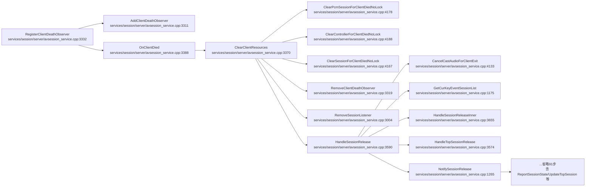
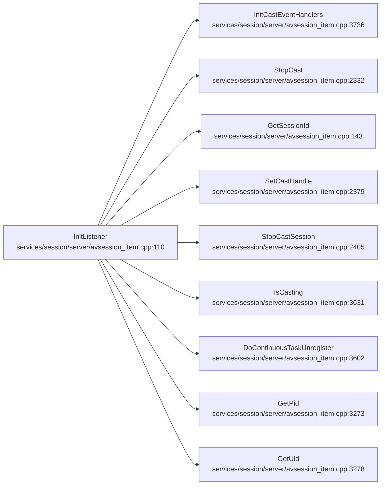
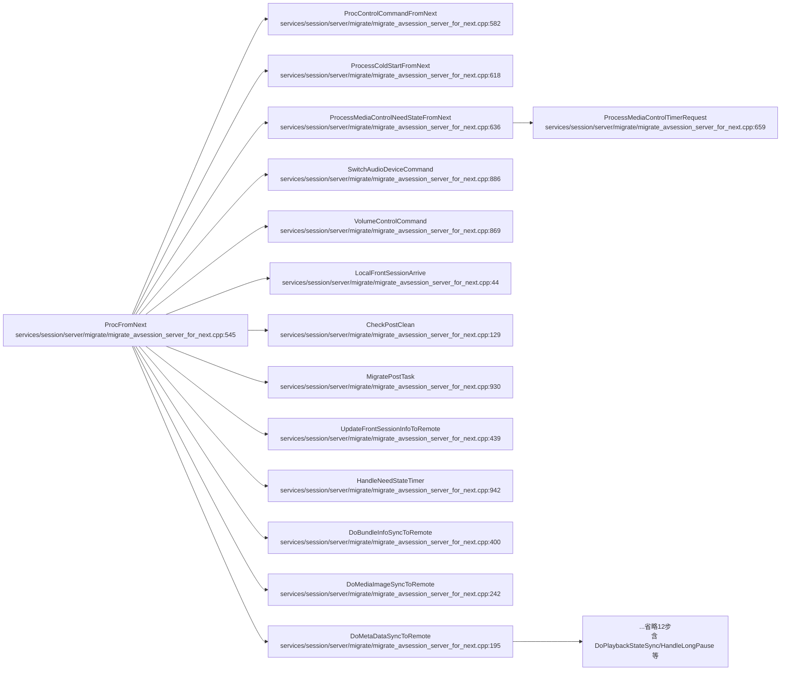

# 客户端/监听生命周期

## 概述
本域管理 AVSession 客户端侧的死亡观察与监听生命周期：`RegisterClientDeathObserver` 注册客户端死亡回调（失败时 `new`/`AddDeathRecipient` 异常即上报 `CONTROL_COMMAND_FAILED`）；`InitListener` 初始化 cast 事件处理器并复用 `StopCast`/`StopCastSession` 等清理逻辑；`ProcFromNext` 处理远端 Next 协议下发的控制命令/冷启动/媒体控制状态消息。典型报错方向：死亡观察注册内存/回调失败（`CONTROL_COMMAND_FAILED` 两条）、Next 消息解析失败（仅 hilog E，无 HiSysEvent）。`InitListener` 与 `ProcFromNext` 链上无 FAULT/SECURITY 级 HiSysEvent 上报。

## 调用序列

### RegisterClientDeathObserver (flow 1, 106 节点, 取前 15 步)

### InitListener (flow 10)

### ProcFromNext (flow 8, 27 节点, 取前 15 步)

## 逐步错误上报

### RegisterClientDeathObserver (flow 1)
- **步骤**：`RegisterClientDeathObserver (services/session/server/avsession_service.cpp:3332)`
  - **上报**：`CONTROL_COMMAND_FAILED`（FAULT）
  - **错误条件**：:3337 `new(std::nothrow) ClientDeathRecipient` 返回 nullptr（内存分配失败）→ :3341 上报 `ERROR_TYPE="RGS_CLIENT_DEATH_OBSERVER_FAILED"`，返回 `AVSESSION_ERROR`；:3346 `observer->AsObject()->AddDeathRecipient(recipient)` 返回 false → :3348 上报 `ERROR_TYPE="RGS_CLIENT_DEATH_FAILED"`、`CALLING_PID=pid`，返回 `AVSESSION_ERROR`。成功路径 :3353 `AddClientDeathObserver` 入表，返回 `AVSESSION_SUCCESS`。
  - **file:line**：`services/session/server/avsession_service.cpp:3341` 与 `:3348`
- **步骤**：`OnClientDied (services/session/server/avsession_service.cpp:3388)`：调 `ClearClientResources(pid,true)` 级联清理（见 AVSession 域 HandleSessionRelease 链），无本域独立 HiSysEvent；:3406 `ReportPlayingState` 经 `AVSessionSysEvent` 走统计，非 FAULT。

### InitListener (flow 10)
- **步骤**：`InitListener (services/session/server/avsession_item.cpp:110)`：初始化 cast 事件处理器；链上 `StopCast:2332`/`StopCastSession:2405`/`DoContinuousTaskUnregister:3602` 均**无 HiSysEvent**。`StopCast` 使用 `AVSessionRadar`（雷达埋点）+ `SLOGI`/`CHECK_AND_RETURN_RET_LOG`；:2351 `serviceCallbackStopSinkCast_==nullptr` 返回 `AVSESSION_ERROR`（hilog）；:2373 `StopCast` 失败返回 `AVSESSION_ERROR`（hilog）。
  - **上报**：无。

### ProcFromNext (flow 8)
- **步骤**：`ProcFromNext (services/session/server/migrate/migrate_avsession_server_for_next.cpp:545)`
  - **上报**：无 HiSysEvent（仅 hilog E）。
  - **错误条件**：:547 `data.length()<=MSG_HEAD_LENGTH` → :548 `SLOGE data too short`；:554 `TransferStrToJson` 失败 → :555 `SLOGE parse json fail`；:575 `default` 分支 → :576 `SLOGE messageType not support`。
- **步骤**：`ProcControlCommandFromNext (...):582`：:584 commandJsonValue 非法 `SLOGE`；:601 `controller==nullptr` `CHECK_AND_RETURN_LOG`；:605 `SetCommand` 失败 :606 `SLOGE parse invalid command type`。均 hilog，无 HiSysEvent。
- **步骤**：`ProcessColdStartFromNext:618`/`ProcessMediaControlNeedStateFromNext:636`/`ProcessMediaControlTimerRequest:659`：参数校验 `CHECK_AND_RETURN_LOG`/`SLOGE/SLOGW`（:621,:639,:681 超时钳制），无 HiSysEvent。

## 错误目录

| 事件名 | 类型 | 级别 | 触发流 | 上报 file:line | 错误条件 |
|---|---|---|---|---|---|
| CONTROL_COMMAND_FAILED | FAULT | MINOR | RegisterClientDeathObserver | services/session/server/avsession_service.cpp:3341 | new ClientDeathRecipient 失败(nullptr,内存分配失败) |
<!-- ERR: CONTROL_COMMAND_FAILED | FAULT | MINOR | RegisterClientDeathObserver | services/session/server/avsession_service.cpp:3341 | new ClientDeathRecipient 失败(nullptr,内存分配失败) -->
| CONTROL_COMMAND_FAILED | FAULT | MINOR | RegisterClientDeathObserver | services/session/server/avsession_service.cpp:3348 | AddDeathRecipient 失败(注册死亡回调失败) |
<!-- ERR: CONTROL_COMMAND_FAILED | FAULT | MINOR | RegisterClientDeathObserver | services/session/server/avsession_service.cpp:3348 | AddDeathRecipient 失败(注册死亡回调失败) -->
| NONE | - | - | InitListener/ProcFromNext | - | 本域 InitListener/ProcFromNext 链无 FAULT/SECURITY 级 HiSysEvent,仅 hilog E |
<!-- ERR: NONE | - | - | InitListener/ProcFromNext | - | 本域 InitListener/ProcFromNext 链无 FAULT/SECURITY 级 HiSysEvent,仅 hilog E -->

## 下钻锚点
- 死亡观察注册：`services/session/server/avsession_service.cpp:3332`（RegisterClientDeathObserver）
- 死亡观察失败上报：`:3341`（OBSERVER_FAILED）/ `:3348`（DEATH_FAILED）
- 客户端死亡清理：`services/session/server/avsession_service.cpp:3388`（OnClientDied）→ `:3370`（ClearClientResources）
- 监听初始化：`services/session/server/avsession_item.cpp:110`（InitListener）
- Next 消息处理：`services/session/server/migrate/migrate_avsession_server_for_next.cpp:545`（ProcFromNext）
