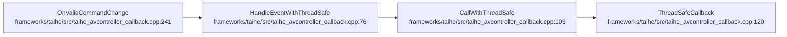

# 命令控制生命周期

## 概述
本生命周期覆盖 AVSession 控制命令的端到端处理：上层 `AVSessionManagerImpl::SendSystemControlCommand`/napi/taihe 包装层先做参数与服务获取校验（非法命令/服务不存在写 `CONTROL_COMMAND_FAILED`，无权限写 `CONTROL_PERMISSION_DENIED`）；服务侧 `AVSessionService::SendSystemControlCommand` 走冷启动会话校验与播放；`AVSessionItem::ExecuteControllerCommand` 执行时遇非法命令码写 `CONTROL_COMMAND_FAILED`；`SetSupportCommand`/`DeleteSupportCommand` 增删支持命令并经 `HandleCastValidCommandChange` 同步到投屏；`OnValidCommandChange` 是 taihe 框架层线程安全回调。典型报错方向是权限拒绝、命令非法、IPC 投递失败、客户端死亡监听注册失败。

## 调用序列

### SendSystemControlCommand (flow 6)

```mermaid
flowchart LR
    f6_1["SendSystemControlCommand<br/>services/session/server/avsession_service.cpp:3280"] --> f6_2["CheckSessionHandleKeyEvent<br/>services/session/server/avsession_service.cpp:3099"]
    f6_2 --> f6_3["HandleSystemKeyColdStart<br/>services/session/server/avsession_service.cpp:3217"]
    f6_3 --> f6_4["CheckIfOtherAudioPlaying<br/>services/session/server/avsession_service.cpp:3273"]
    f6_4 --> f6_5["GetColdStartSessionDescriptors<br/>services/session/server/avsession_service.cpp:2314"]
    f6_5 --> f6_6["GetCurSessionListForFront<br/>services/session/server/avsession_service.cpp:1169"]
    f6_6 --> f6_7["IsAncoValid<br/>services/session/server/avsession_service.cpp:3093"]
    f6_7 --> f6_8["StartAVPlayback<br/>services/session/server/avsession_service.cpp:2674"]
    f6_8 --> f6_9["GetHistoricalSessionDescriptorsFromFile<br/>services/session/server/avsession_service.cpp:2285"]
    f6_9 --> f6_10["CheckStartAncoMediaPlay<br/>services/session/server/avsession_service.cpp:2615"]
    f6_10 --> f6_11["ReportSessionControl<br/>services/session/server/avsession_service.cpp:4964"]
    f6_11 --> f6_12["省略7步<br/>...:NNN"]
```

### ExecuteCommonCommand (flow 22)

```mermaid
flowchart LR
    f22_1["ExecuteCommonCommand<br/>services/session/server/pcm_cast_session.cpp:407"] --> f22_2["BypassCommandParams<br/>services/session/server/pcm_cast_session.cpp:482"]
    f22_2 --> f22_3["CastStateCommandParams<br/>services/session/server/pcm_cast_session.cpp:433"]
    f22_3 --> f22_4["ControlCommandParams<br/>services/session/server/pcm_cast_session.cpp:521"]
    f22_4 --> f22_5["QueryCommandParams<br/>services/session/server/pcm_cast_session.cpp:500"]
    f22_5 --> f22_6["UpdateDeviceNameCommandParams<br/>services/session/server/pcm_cast_session.cpp:551"]
    f22_6 --> f22_7["CreateStreamPlayer<br/>services/session/server/pcm_cast_session.cpp:615"]
    f22_7 --> f22_8["ReleaseStreamPlayer<br/>services/session/server/pcm_cast_session.cpp:625"]
    f22_8 --> f22_9["SaveDataInPcm<br/>services/session/server/pcm_cast_session.cpp:592"]
    f22_9 --> f22_10["QueryData<br/>services/session/server/pcm_cast_session.cpp:558"]
    f22_10 --> f22_11["省略7步<br/>...:NNN"]
```

### SetSupportCommand (flow 12)

```mermaid
flowchart LR
    f12_1["SetSupportCommand<br/>services/session/server/avsession_item.cpp:2789"] --> f12_2["GetBundleName<br/>services/session/server/avsession_item.cpp:3294"]
    f12_2 --> f12_3["GetSessionId<br/>services/session/server/avsession_item.cpp:143"]
    f12_3 --> f12_4["GetSessionType<br/>services/session/server/avsession_item.cpp:148"]
    f12_4 --> f12_5["ProcessFrontSession<br/>services/session/server/avsession_item.cpp:334"]
    f12_5 --> f12_6["HandleFrontSession<br/>services/session/server/avsession_item.cpp:374"]
    f12_6 --> f12_7["GetCurrentCastItem<br/>services/session/server/avsession_item.cpp:3651"]
    f12_7 --> f12_8["UpdateRecommendInfo<br/>services/session/server/avsession_item.cpp:342"]
    f12_8 --> f12_9["IsAppSupportCast<br/>services/session/server/avsession_item.cpp:2596"]
    f12_9 --> f12_10["GetExtras<br/>services/session/server/avsession_item.cpp:2853"]
    f12_10 --> f12_11["GetMetaDataWithoutImg<br/>services/session/server/avsession_item.cpp:2721"]
```

### DeleteSupportCommand (flow 11)

```mermaid
flowchart LR
    f11_1["DeleteSupportCommand<br/>services/session/server/avsession_item.cpp:1509"] --> f11_2["GetBundleName<br/>services/session/server/avsession_item.cpp:3294"]
    f11_2 --> f11_3["GetSessionId<br/>services/session/server/avsession_item.cpp:143"]
    f11_3 --> f11_4["GetSessionType<br/>services/session/server/avsession_item.cpp:148"]
    f11_4 --> f11_5["ProcessFrontSession<br/>services/session/server/avsession_item.cpp:334"]
    f11_5 --> f11_6["RemoveSessionCommandFromCast<br/>services/session/server/avsession_item.cpp:1869"]
    f11_6 --> f11_7["ReportCommandChange<br/>services/session/server/avsession_item.cpp:3710"]
    f11_7 --> f11_8["HandleFrontSession<br/>services/session/server/avsession_item.cpp:374"]
    f11_8 --> f11_9["HandleCastValidCommandChange<br/>services/session/server/avsession_item.cpp:1960"]
    f11_9 --> f11_10["SessionCommandToCastCommand<br/>services/session/server/avsession_item.cpp:1842"]
    f11_10 --> f11_11["省略7步<br/>...:NNN"]
```

### OnValidCommandChange (flow 48)

## 逐步错误上报

### SendSystemControlCommand → 包装层命令校验（manager_impl）
- **步骤**：`AVSessionManagerImpl::SendSystemControlCommand (frameworks/native/session/src/avsession_manager_impl.cpp:434)`
- **上报**：`CONTROL_COMMAND_FAILED`（FAULT/MINOR）
- **错误条件**：`command.IsValid()` 为假（`ERROR_TYPE=INVALID_COMMAND`，返回 ERR_COMMAND_NOT_SUPPORT）
- **file:line**：`frameworks/native/session/src/avsession_manager_impl.cpp:439`

### SendSystemControlCommand → 包装层服务获取失败
- **步骤**：`AVSessionManagerImpl::SendSystemControlCommand (frameworks/native/session/src/avsession_manager_impl.cpp:444)`
- **上报**：`CONTROL_COMMAND_FAILED`（FAULT/MINOR）
- **错误条件**：`GetService()` 返回 nullptr（`ERROR_TYPE=GET_SERVICE_ERROR`，返回 ERR_SERVICE_NOT_EXIST）
- **file:line**：`frameworks/native/session/src/avsession_manager_impl.cpp:446`

### SendSystemControlCommand → napi 投递失败
- **步骤**：`napi SendSystemControlCommand (frameworks/js/napi/session/src/napi_avsession_manager.cpp:~1350)`
- **上报**：`CONTROL_COMMAND_FAILED`（FAULT/MINOR）
- **错误条件**：service->SendSystemControlCommand 返回非成功（`ERROR_TYPE=SEND_CMD_FAILED`，带 CMD/TIME/SPEED/MODE/ASSETID/ERROR_CODE）
- **file:line**：`frameworks/js/napi/session/src/napi_avsession_manager.cpp:1366`

### SendSystemControlCommand → napi 无权限
- **步骤**：`napi SendSystemControlCommand (frameworks/js/napi/session/src/napi_avsession_manager.cpp:1373)`
- **上报**：`CONTROL_PERMISSION_DENIED`（SECURITY/CRITICAL）
- **错误条件**：返回 ERR_NO_PERMISSION（native send control command no permission）
- **file:line**：`frameworks/js/napi/session/src/napi_avsession_manager.cpp:1375`

### SendSystemControlCommand → taihe 投递失败
- **步骤**：`taihe SendSystemControlCommandSync (frameworks/taihe/src/taihe_avsession_manager.cpp:~1265)`
- **上报**：`CONTROL_COMMAND_FAILED`（FAULT/MINOR）
- **错误条件**：native send control command failed（`ERROR_TYPE=SEND_CMD_FAILED`）
- **file:line**：`frameworks/taihe/src/taihe_avsession_manager.cpp:1276`

### SendSystemControlCommand → taihe 无权限
- **步骤**：`taihe SendSystemControlCommandSync (frameworks/taihe/src/taihe_avsession_manager.cpp:1285)`
- **上报**：`CONTROL_PERMISSION_DENIED`（SECURITY/CRITICAL）
- **错误条件**：返回 ERR_NO_PERMISSION
- **file:line**：`frameworks/taihe/src/taihe_avsession_manager.cpp:1289`

### SendSystemControlCommand → 服务侧 IPC stub 权限拒绝（多入口）
- **步骤**：`AVSessionServiceStub 各 On*Request 入口 (services/session/ipc/stub/avsession_service_stub.cpp)`
- **上报**：`CONTROL_PERMISSION_DENIED`（SECURITY/CRITICAL）
- **错误条件**：CheckSystemPermission/CheckPermission 失败（CALLER_UID/CALLER_PID/SESSION_ID/BUNDLE_NAME/CMD/ERROR_CODE/ERROR_MSG）
- **file:line**：`services/session/ipc/stub/avsession_service_stub.cpp:112`（以及 133/166/229/267/311/355/384/430/464/515/532/579/618/645/678/701/729/752/786/835 同模式）

### SendSystemControlCommand → 服务侧 IPC stub 读 parcel 失败
- **步骤**：`AVSessionServiceStub (services/session/ipc/stub/avsession_service_stub.cpp:450)`
- **上报**：`CONTROL_COMMAND_FAILED`（FAULT/MINOR）
- **错误条件**：data.ReadInt32/Unmarshalling 失败（`ERROR_TYPE=READ_PARCELABLE_FAILED`）
- **file:line**：`services/session/ipc/stub/avsession_service_stub.cpp:456`

### SendSystemControlCommand → 服务侧获取描述符权限拒绝
- **步骤**：`AVSessionService::GetSessionDescriptorsBySessionId (services/session/server/avsession_service.cpp:~2210)`
- **上报**：`CONTROL_PERMISSION_DENIED`（SECURITY/CRITICAL）
- **错误条件**：caller pid/uid 与 session 不符且 CheckSystemPermission 失败
- **file:line**：`services/session/server/avsession_service.cpp:2225`

### SendSystemControlCommand → 创建会话失败
- **步骤**：`AVSessionService::CreateSessionInner (services/session/server/avsession_service.cpp:1877)`
- **上报**：`CONTROL_COMMAND_FAILED`（FAULT/MINOR）
- **错误条件**：`CreateNewSession` 返回 nullptr（无内存，返回 ERR_NO_MEMORY）
- **file:line**：`services/session/server/avsession_service.cpp:1883`

### SendSystemControlCommand → 客户端死亡监听注册失败（malloc）
- **步骤**：`AVSessionService::RegisterClientDeathObserver (services/session/server/avsession_service.cpp:3337)`
- **上报**：`CONTROL_COMMAND_FAILED`（FAULT/MINOR）
- **错误条件**：`new ClientDeathRecipient` 返回 nullptr（`ERROR_TYPE=RGS_CLIENT_DEATH_OBSERVER_FAILED`）
- **file:line**：`services/session/server/avsession_service.cpp:3341`

### SendSystemControlCommand → 客户端死亡监听添加失败
- **步骤**：`AVSessionService::RegisterClientDeathObserver (services/session/server/avsession_service.cpp:3346)`
- **上报**：`CONTROL_COMMAND_FAILED`（FAULT/MINOR）
- **错误条件**：`AddDeathRecipient` 返回 false（`ERROR_TYPE=RGS_CLIENT_DEATH_FAILED`）
- **file:line**：`services/session/server/avsession_service.cpp:3348`

### ExecuteControllerCommand → 非法命令码
- **步骤**：`AVSessionItem::ExecuteControllerCommand (services/session/server/avsession_item.cpp:2996)`
- **上报**：`CONTROL_COMMAND_FAILED`（FAULT/MINOR）
- **错误条件**：`cmdHandlers[code]` 未命中/命令码非法（`ERROR_TYPE=INVALID_COMMAND`，CMD=code）。注意此行在 `return cmdHandlers[code](cmdBack)` 之后，LCOV 排除段，实际由更早分支触发
- **file:line**：`services/session/server/avsession_item.cpp:2998`

### SetSupportCommand / DeleteSupportCommand
- 这两个 flow 的步骤本身**无直接 HiSysEvent 错误上报**；命令增删经 `ReportCommandChange`（行为埋点）与 `HandleCastValidCommandChange` 同步到投屏。统计侧由 `CONTROL_COMMAND_STATISTICS`/`CONTROL_COMMAND_FAILED_RATE` 聚合。

### 命令失败率统计（周期聚合）
- **步骤**：`AVSessionSysEvent::Report (utils/src/avsession_sysevent.cpp:~105)`
- **上报**：`CONTROL_COMMAND_FAILED_RATE`（STATISTIC/MINOR）
- **错误条件**：周期统计时计算 failedRate = (allCtrlCmdCount - allSuccCmdCount)/(allCtrlCmdCount*2)；当 allSuccCmdCount > allCtrlCmdCount 时记 0
- **file:line**：`utils/src/avsession_sysevent.cpp:123`（异常分支 :126）

### OnValidCommandChange（框架层回调）
- taihe 框架层 `OnValidCommandChange`/`HandleEventWithThreadSafe`/`CallWithThreadSafe`/`ThreadSafeCallback` **无直接 HiSysEvent 错误上报**；线程安全调度失败仅 SLOGE。

## 错误目录

<!-- ERR: CONTROL_COMMAND_FAILED | FAULT | MINOR | SendSystemControlCommand | frameworks/native/session/src/avsession_manager_impl.cpp:439 | command.IsValid 为假 INVALID_COMMAND -->
<!-- ERR: CONTROL_COMMAND_FAILED | FAULT | MINOR | SendSystemControlCommand | frameworks/native/session/src/avsession_manager_impl.cpp:446 | GetService 返回 nullptr GET_SERVICE_ERROR -->
<!-- ERR: CONTROL_COMMAND_FAILED | FAULT | MINOR | SendSystemControlCommand | frameworks/js/napi/session/src/napi_avsession_manager.cpp:1366 | native 投递失败 SEND_CMD_FAILED -->
<!-- ERR: CONTROL_PERMISSION_DENIED | SECURITY | CRITICAL | SendSystemControlCommand | frameworks/js/napi/session/src/napi_avsession_manager.cpp:1375 | ERR_NO_PERMISSION native 无权限 -->
<!-- ERR: CONTROL_COMMAND_FAILED | FAULT | MINOR | SendSystemControlCommand | frameworks/taihe/src/taihe_avsession_manager.cpp:1276 | native 投递失败 SEND_CMD_FAILED -->
<!-- ERR: CONTROL_PERMISSION_DENIED | SECURITY | CRITICAL | SendSystemControlCommand | frameworks/taihe/src/taihe_avsession_manager.cpp:1289 | ERR_NO_PERMISSION -->
<!-- ERR: CONTROL_PERMISSION_DENIED | SECURITY | CRITICAL | SendSystemControlCommand | services/session/ipc/stub/avsession_service_stub.cpp:112 | IPC stub 系统权限校验失败 -->
<!-- ERR: CONTROL_PERMISSION_DENIED | SECURITY | CRITICAL | SendSystemControlCommand | services/session/ipc/stub/avsession_service_stub.cpp:267 | IPC stub 系统权限校验失败 -->
<!-- ERR: CONTROL_PERMISSION_DENIED | SECURITY | CRITICAL | SendSystemControlCommand | services/session/ipc/stub/avsession_service_stub.cpp:515 | IPC stub 系统权限校验失败 -->
<!-- ERR: CONTROL_PERMISSION_DENIED | SECURITY | CRITICAL | SendSystemControlCommand | services/session/ipc/stub/avsession_service_stub.cpp:645 | IPC stub 系统权限校验失败 -->
<!-- ERR: CONTROL_PERMISSION_DENIED | SECURITY | CRITICAL | SendSystemControlCommand | services/session/ipc/stub/avsession_service_stub.cpp:786 | IPC stub 系统权限校验失败 -->
<!-- ERR: CONTROL_COMMAND_FAILED | FAULT | MINOR | SendSystemControlCommand | services/session/ipc/stub/avsession_service_stub.cpp:456 | data 读 parcel 失败 READ_PARCELABLE_FAILED -->
<!-- ERR: CONTROL_PERMISSION_DENIED | SECURITY | CRITICAL | SendSystemControlCommand | services/session/server/avsession_service.cpp:2225 | 获取描述符权限校验失败 -->
<!-- ERR: CONTROL_COMMAND_FAILED | FAULT | MINOR | SendSystemControlCommand | services/session/server/avsession_service.cpp:1883 | CreateNewSession 返回 nullptr 无内存 -->
<!-- ERR: CONTROL_COMMAND_FAILED | FAULT | MINOR | SendSystemControlCommand | services/session/server/avsession_service.cpp:3341 | ClientDeathRecipient malloc 失败 -->
<!-- ERR: CONTROL_COMMAND_FAILED | FAULT | MINOR | SendSystemControlCommand | services/session/server/avsession_service.cpp:3348 | AddDeathRecipient 返回 false -->
<!-- ERR: CONTROL_COMMAND_FAILED | FAULT | MINOR | ExecuteCommonCommand | services/session/server/avsession_item.cpp:2998 | 命令码非法 INVALID_COMMAND -->
<!-- ERR: CONTROL_COMMAND_FAILED_RATE | STATISTIC | MINOR | SendSystemControlCommand | utils/src/avsession_sysevent.cpp:123 | 周期聚合命令失败率 -->
<!-- ERR: CONTROL_COMMAND_FAILED_RATE | STATISTIC | MINOR | SendSystemControlCommand | utils/src/avsession_sysevent.cpp:126 | succCount>allCount 异常记 0 -->

| 事件名 | 类型 | 级别 | 触发流 | 上报 file:line | 错误条件 |
|---|---|---|---|---|---|
| CONTROL_COMMAND_FAILED | FAULT | MINOR | SendSystemControlCommand | frameworks/native/session/src/avsession_manager_impl.cpp:439 | command.IsValid 为假 INVALID_COMMAND |
| CONTROL_COMMAND_FAILED | FAULT | MINOR | SendSystemControlCommand | frameworks/native/session/src/avsession_manager_impl.cpp:446 | GetService 返回 nullptr GET_SERVICE_ERROR |
| CONTROL_COMMAND_FAILED | FAULT | MINOR | SendSystemControlCommand | frameworks/js/napi/session/src/napi_avsession_manager.cpp:1366 | native 投递失败 SEND_CMD_FAILED |
| CONTROL_PERMISSION_DENIED | SECURITY | CRITICAL | SendSystemControlCommand | frameworks/js/napi/session/src/napi_avsession_manager.cpp:1375 | ERR_NO_PERMISSION native 无权限 |
| CONTROL_COMMAND_FAILED | FAULT | MINOR | SendSystemControlCommand | frameworks/taihe/src/taihe_avsession_manager.cpp:1276 | native 投递失败 SEND_CMD_FAILED |
| CONTROL_PERMISSION_DENIED | SECURITY | CRITICAL | SendSystemControlCommand | frameworks/taihe/src/taihe_avsession_manager.cpp:1289 | ERR_NO_PERMISSION |
| CONTROL_PERMISSION_DENIED | SECURITY | CRITICAL | SendSystemControlCommand | services/session/ipc/stub/avsession_service_stub.cpp:112 | IPC stub 系统权限校验失败 |
| CONTROL_PERMISSION_DENIED | SECURITY | CRITICAL | SendSystemControlCommand | services/session/ipc/stub/avsession_service_stub.cpp:267 | IPC stub 系统权限校验失败 |
| CONTROL_PERMISSION_DENIED | SECURITY | CRITICAL | SendSystemControlCommand | services/session/ipc/stub/avsession_service_stub.cpp:515 | IPC stub 系统权限校验失败 |
| CONTROL_PERMISSION_DENIED | SECURITY | CRITICAL | SendSystemControlCommand | services/session/ipc/stub/avsession_service_stub.cpp:645 | IPC stub 系统权限校验失败 |
| CONTROL_PERMISSION_DENIED | SECURITY | CRITICAL | SendSystemControlCommand | services/session/ipc/stub/avsession_service_stub.cpp:786 | IPC stub 系统权限校验失败 |
| CONTROL_COMMAND_FAILED | FAULT | MINOR | SendSystemControlCommand | services/session/ipc/stub/avsession_service_stub.cpp:456 | data 读 parcel 失败 READ_PARCELABLE_FAILED |
| CONTROL_PERMISSION_DENIED | SECURITY | CRITICAL | SendSystemControlCommand | services/session/server/avsession_service.cpp:2225 | 获取描述符权限校验失败 |
| CONTROL_COMMAND_FAILED | FAULT | MINOR | SendSystemControlCommand | services/session/server/avsession_service.cpp:1883 | CreateNewSession 返回 nullptr 无内存 |
| CONTROL_COMMAND_FAILED | FAULT | MINOR | SendSystemControlCommand | services/session/server/avsession_service.cpp:3341 | ClientDeathRecipient malloc 失败 |
| CONTROL_COMMAND_FAILED | FAULT | MINOR | SendSystemControlCommand | services/session/server/avsession_service.cpp:3348 | AddDeathRecipient 返回 false |
| CONTROL_COMMAND_FAILED | FAULT | MINOR | ExecuteCommonCommand | services/session/server/avsession_item.cpp:2998 | 命令码非法 INVALID_COMMAND |
| CONTROL_COMMAND_FAILED_RATE | STATISTIC | MINOR | SendSystemControlCommand | utils/src/avsession_sysevent.cpp:123 | 周期聚合命令失败率 |
| CONTROL_COMMAND_FAILED_RATE | STATISTIC | MINOR | SendSystemControlCommand | utils/src/avsession_sysevent.cpp:126 | succCount>allCount 异常记 0 |
