# 设备/服务连接生命周期

## 概述
本生命周期覆盖 AVSession 服务的启动与设备连接主线：`OnStart`→`OnStartProcess` 写 `SESSION_SERVICE_START` 行为埋点并加载控制名单；`OnAddSystemAbility` 监听 AMS/BMS/DM/Collaboration 等系统能力就绪后初始化各子服务并处理焦点会话（写 `FOCUS_CHANGE`）；`DoTargetDevListenWithDM`/`OnDeviceReady`/`NotifyDeviceOffline` 走设备发现与迁移连接；`OnConnectServer`/`OnConnectProxy` 建立迁移 proxy 与 server 的 IPC/软总线连接。典型报错方向是服务启动埋点缺失（`SESSION_SERVICE_START` 未落）和焦点切换异常。

## 调用序列

### OnStart (flow 28)

```mermaid
flowchart LR
    f28_1["OnStart<br/>services/session/server/avsession_service.cpp:155"] --> f28_2["OnStartProcess<br/>services/session/server/avsession_service.cpp:164"]
    f28_2 --> f28_3["UpdateControlListFromFile<br/>services/session/server/avsession_service.cpp:2114"]
    f28_3 --> f28_4["LoadStringFromFileEx<br/>services/session/server/avsession_service.cpp:4270"]
    f28_4 --> f28_5["CheckAndCreateDir<br/>services/session/server/avsession_service.cpp:4230"]
    f28_5 --> f28_6["CheckStringAndCleanFile<br/>services/session/server/avsession_service.cpp:4348"]
    f28_6 --> f28_7["FillFileWithEmptyContentEx<br/>services/session/server/avsession_service.cpp:4241"]
    f28_7 --> f28_8["CheckUserDirValid<br/>services/session/server/avsession_service.cpp:4217"]
```

### OnAddSystemAbility (flow 15)

### OnConnectServer (flow 7)

### OnConnectProxy (flow 17)

### OnDeviceReady (flow 30)

### NotifyDeviceOffline (flow 16)

```mermaid
flowchart LR
    f16_1["NotifyDeviceOffline<br/>services/session/server/avsession_service_ext.cpp:500"] --> f16_2["OnDeviceOffline<br/>services/session/server/avsession_service_ext.cpp:793"]
    f16_2 --> f16_3["ProcessTargetMigrate<br/>services/session/server/avsession_service_ext.cpp:845"]
    f16_3 --> f16_4["CheckWhetherTargetDevIsNext<br/>services/session/server/avsession_service_ext.cpp:1070"]
    f16_4 --> f16_5["DoConnectProcessWithMigrate<br/>services/session/server/avsession_service_ext.cpp:896"]
    f16_5 --> f16_6["DoDisconnectProcessWithMigrate<br/>services/session/server/avsession_service_ext.cpp:949"]
    f16_6 --> f16_7["DoRemoteAVSessionLoad<br/>services/session/server/avsession_service_ext.cpp:867"]
    f16_7 --> f16_8["省略5步<br/>...:NNN"]
```

### DoTargetDevListenWithDM (flow 31)

```mermaid
flowchart LR
    f31_1["DoTargetDevListenWithDM<br/>services/session/server/avsession_service_ext.cpp:818"] --> f31_2["GetLocalDeviceType<br/>services/session/server/avsession_service_ext.cpp:808"]
    f31_2 --> f31_3["ProcessTargetMigrate<br/>services/session/server/avsession_service_ext.cpp:845"]
    f31_3 --> f31_4["CheckWhetherTargetDevIsNext<br/>services/session/server/avsession_service_ext.cpp:1070"]
    f31_4 --> f31_5["DoConnectProcessWithMigrate<br/>services/session/server/avsession_service_ext.cpp:896"]
    f31_5 --> f31_6["DoDisconnectProcessWithMigrate<br/>services/session/server/avsession_service_ext.cpp:949"]
    f31_6 --> f31_7["DoRemoteAVSessionLoad<br/>services/session/server/avsession_service_ext.cpp:867"]
    f31_7 --> f31_8["省略5步<br/>...:NNN"]
```

## 逐步错误上报

### OnStart → OnStartProcess（服务启动埋点）
- **步骤**：`OnStartProcess (services/session/server/avsession_service.cpp:164)`
- **上报**：`SESSION_SERVICE_START`（BEHAVIOR/MINOR）
- **错误条件**：服务启动成功路径埋点（SERVICE_NAME=AVSessionService，SERVICE_ID，DETAILED_MSG="avsession service start success"）；非错误，但启动失败则不达此行——`OnStart` 若前置 Init 失败不会进入此埋点
- **file:line**：`services/session/server/avsession_service.cpp:203`

### OnAddSystemAbility → 焦点会话切换
- **步骤**：`HandleFocusSession → SelectFocusSession → ReportFocusSessionChange (services/session/server/avsession_service.cpp:707)`
- **上报**：`FOCUS_CHANGE`（BEHAVIOR/MINOR）
- **错误条件**：topSession 切换时上报新旧会话信息（非错误，行为埋点）；用于追踪焦点归属异常
- **file:line**：`services/session/server/avsession_service.cpp:709`

### OnAddSystemAbility → UpdateTopSession 置空
- **步骤**：`UpdateTopSession (services/session/server/avsession_service.cpp:735)`
- **上报**：`FOCUS_CHANGE`（BEHAVIOR/MINOR）
- **错误条件**：newTopSession 为 nullptr 时置空 topSession_ 并上报（焦点丢失）
- **file:line**：`services/session/server/avsession_service.cpp:749`

### 焦点策略选中
- **步骤**：`FocusSessionStrategy (services/session/server/focus_session_strategy.cpp:~168)`
- **上报**：`FOCUS_CHANGE`（BEHAVIOR/MINOR）
- **错误条件**：isFocus 为真时上报当前焦点 session uid（非错误）
- **file:line**：`services/session/server/focus_session_strategy.cpp:175`

### OnDeviceReady / NotifyDeviceOffline / DoTargetDevListenWithDM
- 这些 flow 的步骤（ProcessTargetMigrate/DoConnectProcessWithMigrate* 等）**无直接 HiSysEvent 上报**，错误通过 SLOGE 日志与返回码体现；迁移失败会经 OnConnectServer/CastAudio 链路间接触发 `REMOTE_CONTROL_FAILED`（见 cast-lifecycle 域）。

### OnConnectServer / OnConnectProxy
- 迁移 proxy/server 建链步骤**无直接 HiSysEvent 上报**；连接异常通过 SLOGE + 返回码，最终在投屏/控制链路落 `REMOTE_CONTROL_FAILED`。

## 错误目录

<!-- ERR: SESSION_SERVICE_START | BEHAVIOR | MINOR | OnStart | services/session/server/avsession_service.cpp:203 | 服务启动成功路径埋点 启动失败则不达 -->
<!-- ERR: FOCUS_CHANGE | BEHAVIOR | MINOR | OnAddSystemAbility | services/session/server/avsession_service.cpp:709 | topSession 切换上报新旧会话信息 -->
<!-- ERR: FOCUS_CHANGE | BEHAVIOR | MINOR | OnAddSystemAbility | services/session/server/avsession_service.cpp:749 | newTopSession 为空 焦点丢失 -->
<!-- ERR: FOCUS_CHANGE | BEHAVIOR | MINOR | OnAddSystemAbility | services/session/server/focus_session_strategy.cpp:175 | 焦点策略选中焦点 session -->

| 事件名 | 类型 | 级别 | 触发流 | 上报 file:line | 错误条件 |
|---|---|---|---|---|---|
| SESSION_SERVICE_START | BEHAVIOR | MINOR | OnStart | services/session/server/avsession_service.cpp:203 | 服务启动成功路径埋点 启动失败则不达 |
| FOCUS_CHANGE | BEHAVIOR | MINOR | OnAddSystemAbility | services/session/server/avsession_service.cpp:709 | topSession 切换上报新旧会话信息 |
| FOCUS_CHANGE | BEHAVIOR | MINOR | OnAddSystemAbility | services/session/server/avsession_service.cpp:749 | newTopSession 为空 焦点丢失 |
| FOCUS_CHANGE | BEHAVIOR | MINOR | OnAddSystemAbility | services/session/server/focus_session_strategy.cpp:175 | 焦点策略选中焦点 session |
