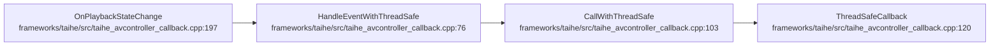
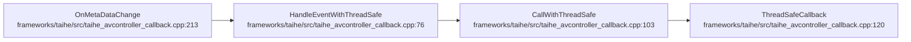

# 事件回调生命周期

## 概述
本生命周期覆盖 AVSession 各类事件回调与状态同步：服务侧 `OnReceiveEvent` 接收系统公共事件（用户切换/媒体卡/包卸载/首解锁）并驱动置顶会话更新（写 `FOCUS_CHANGE`）；taihe 框架层 `OnPlaybackStateChange`/`OnMetaDataChange`/`OnValidCommandChange` 经线程安全调度回调上层；`OnMetadataChange`/`OnMetadataChangeAll` 处理控制器元数据过滤与注册；迁移侧 `OnTopSessionChange`/`OnHistoricalRecordChange`/`LocalFrontSessionChange` 把本地前台会话与历史记录同步到远端。典型报错方向是音频渲染态与 AVSession 播放态不一致（`AVSESSION_WRONG_STATE`）和焦点切换异常（`FOCUS_CHANGE` 行为埋点用于追踪）。

## 调用序列

### OnReceiveEvent (flow 14)

```mermaid
flowchart LR
    f14_1["OnReceiveEvent<br/>services/session/server/avsession_service.cpp:277"] --> f14_2["HandleBundleRemoveEvent<br/>services/session/server/avsession_service.cpp:457"]
    f14_2 --> f14_3["HandleFirstUnlockCleanup<br/>services/session/server/avsession_service.cpp:463"]
    f14_3 --> f14_4["HandleMediaCardStateChangeEvent<br/>services/session/server/avsession_service.cpp:428"]
    f14_4 --> f14_5["HandleRemoveMediaCardEvent<br/>services/session/server/avsession_service.cpp:372"]
    f14_5 --> f14_6["HandleUserEvent<br/>services/session/server/avsession_service.cpp:355"]
    f14_6 --> f14_7["InitCastEngineService<br/>services/session/server/avsession_service.cpp:1111"]
    f14_7 --> f14_8["RegisterBundleDeleteEventForHistory<br/>services/session/server/avsession_service.cpp:1119"]
    f14_8 --> f14_9["SetPcMode<br/>services/session/server/avsession_service.cpp:4448"]
    f14_9 --> f14_10["UpdateNtfEnable<br/>services/session/server/avsession_service.cpp:4942"]
    f14_10 --> f14_11["DeleteHistoricalRecord<br/>services/session/server/avsession_service.cpp:3413"]
    f14_11 --> f14_12["IsTopSessionPlaying<br/>services/session/server/avsession_service.cpp:416"]
    f14_12 --> f14_13["省略31步<br/>...:NNN"]
```

### OnPlaybackStateChange (flow 46)

### OnMetaDataChange (flow 47)

### OnMetadataChange (flow 49)

```mermaid
flowchart LR
    f49_1["OnMetadataChange<br/>frameworks/taihe/src/taihe_avsession_controller.cpp:907"] --> f49_2["OnEvent<br/>frameworks/taihe/src/taihe_avsession_controller.cpp:1445"]
    f49_2 --> f49_3["SetMetaFilter<br/>frameworks/taihe/src/taihe_avsession_controller.cpp:1558"]
    f49_3 --> f49_4["RegisterCallback<br/>frameworks/taihe/src/taihe_avsession_controller.cpp:1475"]
    f49_4 --> f49_5["DoRegisterCallback<br/>frameworks/taihe/src/taihe_avsession_controller.cpp:99"]
```

### OnMetadataChangeAll (flow 50)

```mermaid
flowchart LR
    f50_1["OnMetadataChangeAll<br/>frameworks/taihe/src/taihe_avsession_controller.cpp:920"] --> f50_2["OnEvent<br/>frameworks/taihe/src/taihe_avsession_controller.cpp:1445"]
    f50_2 --> f50_3["SetMetaFilter<br/>frameworks/taihe/src/taihe_avsession_controller.cpp:1558"]
    f50_3 --> f50_4["RegisterCallback<br/>frameworks/taihe/src/taihe_avsession_controller.cpp:1475"]
    f50_4 --> f50_5["DoRegisterCallback<br/>frameworks/taihe/src/taihe_avsession_controller.cpp:99"]
```

### OnTopSessionChange (flow 19)

```mermaid
flowchart LR
    f19_1["OnTopSessionChange<br/>services/session/server/migrate/migrate_avsession_server.cpp:494"] --> f19_2["CreateController<br/>services/session/server/migrate/migrate_avsession_server.cpp:195"]
    f19_2 --> f19_3["GetBundleName<br/>services/session/server/migrate/migrate_avsession_server.cpp:979"]
    f19_3 --> f19_4["SendRemoteControllerList<br/>services/session/server/migrate/migrate_avsession_server.cpp:541"]
    f19_4 --> f19_5["SendRemoteHistorySessionList<br/>services/session/server/migrate/migrate_avsession_server.cpp:569"]
    f19_5 --> f19_6["Init<br/>services/session/server/migrate/migrate_avsession_server.cpp:1489"]
    f19_6 --> f19_7["UpdateCache<br/>services/session/server/migrate/migrate_avsession_server.cpp:254"]
    f19_7 --> f19_8["ClearRemoteControllerList<br/>services/session/server/migrate/migrate_avsession_server.cpp:851"]
    f19_8 --> f19_9["ConvertControllersToStr<br/>services/session/server/migrate/migrate_avsession_server.cpp:873"]
    f19_9 --> f19_10["DelaySendMetaData<br/>services/session/server/migrate/migrate_avsession_server.cpp:771"]
    f19_10 --> f19_11["省略18步<br/>...:NNN"]
```

### OnHistoricalRecordChange (flow 20)

```mermaid
flowchart LR
    f20_1["OnHistoricalRecordChange<br/>services/session/server/migrate/migrate_avsession_server.cpp:1302"] --> f20_2["SendRemoteHistorySessionList<br/>services/session/server/migrate/migrate_avsession_server.cpp:569"]
    f20_2 --> f20_3["ConvertHistorySessionListToStr<br/>services/session/server/migrate/migrate_avsession_server.cpp:734"]
    f20_3 --> f20_4["ConvertHisSessionDescriptorsToCJSON<br/>services/session/server/migrate/migrate_avsession_server.cpp:688"]
    f20_4 --> f20_5["ConvertReleaseSessionToCJSON<br/>services/session/server/migrate/migrate_avsession_server.cpp:642"]
    f20_5 --> f20_6["ConvertSessionDescriptorsToCJSON<br/>services/session/server/migrate/migrate_avsession_server.cpp:602"]
    f20_6 --> f20_7["AddBundleImgForSuper<br/>services/session/server/migrate/migrate_avsession_server.cpp:1410"]
    f20_7 --> f20_8["GetBundleName<br/>services/session/server/migrate/migrate_avsession_server.cpp:979"]
    f20_8 --> f20_9["CompressToJPEG<br/>services/session/server/migrate/migrate_avsession_server.cpp:1103"]
```

### LocalFrontSessionChange (flow 21)

```mermaid
flowchart LR
    f21_1["LocalFrontSessionChange<br/>services/session/server/migrate/migrate_avsession_server_for_next.cpp:78"] --> f21_2["LocalFrontSessionArrive<br/>services/session/server/migrate/migrate_avsession_server_for_next.cpp:44"]
    f21_2 --> f21_3["CheckPostClean<br/>services/session/server/migrate/migrate_avsession_server_for_next.cpp:129"]
    f21_3 --> f21_4["MigratePostTask<br/>services/session/server/migrate/migrate_avsession_server_for_next.cpp:930"]
    f21_4 --> f21_5["UpdateFrontSessionInfoToRemote<br/>services/session/server/migrate/migrate_avsession_server_for_next.cpp:439"]
    f21_5 --> f21_6["DoBundleInfoSyncToRemote<br/>services/session/server/migrate/migrate_avsession_server_for_next.cpp:400"]
    f21_6 --> f21_7["DoMediaImageSyncToRemote<br/>services/session/server/migrate/migrate_avsession_server_for_next.cpp:242"]
    f21_7 --> f21_8["DoMetaDataSyncToRemote<br/>services/session/server/migrate/migrate_avsession_server_for_next.cpp:195"]
    f21_8 --> f21_9["DoPlaybackStateSyncToRemote<br/>services/session/server/migrate/migrate_avsession_server_for_next.cpp:323"]
    f21_9 --> f21_10["省略11步<br/>...:NNN"]
```

## 逐步错误上报

### OnReceiveEvent → 置顶会话焦点切换
- **步骤**：`UpdateTopSession → ReportFocusSessionChange (services/session/server/avsession_service.cpp:707)`
- **上报**：`FOCUS_CHANGE`（BEHAVIOR/MINOR）
- **错误条件**：置顶会话切换时上报新旧 session 信息（非错误，行为埋点）；newTopSession 非空且与旧 top 不同
- **file:line**：`services/session/server/avsession_service.cpp:709`

### OnReceiveEvent → 置顶会话置空
- **步骤**：`UpdateTopSession (services/session/server/avsession_service.cpp:735)`
- **上报**：`FOCUS_CHANGE`（BEHAVIOR/MINOR）
- **错误条件**：newTopSession 为 nullptr（焦点丢失/清理）
- **file:line**：`services/session/server/avsession_service.cpp:749`

### 焦点策略选中
- **步骤**：`FocusSessionStrategy (services/session/server/focus_session_strategy.cpp:~168)`
- **上报**：`FOCUS_CHANGE`（BEHAVIOR/MINOR）
- **错误条件**：isFocus 为真时上报当前焦点 session uid（非错误）
- **file:line**：`services/session/server/focus_session_strategy.cpp:175`

### 音频渲染态与播放态不一致（后台报告检查）
- **步骤**：`AVSessionService 后台报告检查 (services/session/server/avsession_service.cpp:~1378)`
- **上报**：`AVSESSION_WRONG_STATE`（FAULT/MINOR）
- **错误条件**：`rState==RENDERER_RUNNING` 且 `aState != PLAYBACK_STATE_PLAY`，或 `rState==RENDERER_PAUSED/STOPPED` 且 `aState==PLAYBACK_STATE_PLAY`（渲染态与会话态不一致）
- **file:line**：`services/session/server/avsession_service.cpp:1384`

### 播放会话质量统计（周期聚合）
- **步骤**：`AVSessionSysEvent::ReportPlayingStateAll (utils/src/avsession_sysevent.cpp:~195)`
- **上报**：`PLAYING_AVSESSION_STATS`（STATISTIC/CRITICAL）
- **错误条件**：周期聚合正在播放会话的状态/元数据质量/控制命令统计（非错误，统计埋点）；用于定位播放质量异常
- **file:line**：`utils/src/avsession_sysevent.cpp:200`（另见 :451 单会话上报）

### 播放会话质量统计（存储事件）
- **步骤**：`AVSessionStorageEvent (utils/src/avsession_storage_event.cpp:~360)`
- **上报**：`PLAYING_AVSESSION_STATS`（STATISTIC/CRITICAL）
- **错误条件**：存储事件触发的播放会话统计
- **file:line**：`utils/src/avsession_storage_event.cpp:364`

### 低质量播放统计
- **步骤**：`AVSessionSysEvent::ReportLowQuality (utils/src/avsession_sysevent.cpp:~65)`
- **上报**：`PLAYING_COMBIND_AVSESSION_STATIS`（STATISTIC/MINOR）
- **错误条件**：低质量检查统计（PLAY_DURATION/STREAM_USAGE/AVSESSION_META_QUALITY 等，非错误）
- **file:line**：`utils/src/avsession_sysevent.cpp:70`

### OnPlaybackStateChange / OnMetaDataChange / OnMetadataChange / OnMetadataChangeAll / OnValidCommandChange（框架层回调）
- 这些 taihe 框架层回调（`HandleEventWithThreadSafe`/`CallWithThreadSafe`/`ThreadSafeCallback`/`OnEvent`/`SetMetaFilter`/`RegisterCallback`/`DoRegisterCallback`）**无直接 HiSysEvent 错误上报**；线程安全调度失败/注册失败仅 SLOGE 日志。元数据过滤与回调注册异常经 SLOGE。

### OnTopSessionChange / OnHistoricalRecordChange / LocalFrontSessionChange（迁移同步）
- 这三个迁移 flow 的步骤（`SendRemoteControllerList`/`Convert*ToStr`/`Do*SyncToRemote` 等）**无直接 HiSysEvent 错误上报**；同步失败通过 SLOGE 与返回码，最终经远端投屏链路间接触发 `REMOTE_CONTROL_FAILED`（见 cast-lifecycle 域）。`OnTopSessionChange` 的置顶会话切换会经服务侧 `UpdateTopSession` 路径写 `FOCUS_CHANGE`（:709/:749）。

## 错误目录

<!-- ERR: FOCUS_CHANGE | BEHAVIOR | MINOR | OnReceiveEvent | services/session/server/avsession_service.cpp:709 | 置顶会话切换上报新旧 session 信息 -->
<!-- ERR: FOCUS_CHANGE | BEHAVIOR | MINOR | OnReceiveEvent | services/session/server/avsession_service.cpp:749 | newTopSession 为空 焦点丢失 -->
<!-- ERR: FOCUS_CHANGE | BEHAVIOR | MINOR | OnReceiveEvent | services/session/server/focus_session_strategy.cpp:175 | 焦点策略选中焦点 session uid -->
<!-- ERR: AVSESSION_WRONG_STATE | FAULT | MINOR | OnReceiveEvent | services/session/server/avsession_service.cpp:1384 | 渲染态 RUNNING 但会话非 PLAY 或 渲染态 PAUSED/STOPPED 但会话 PLAY -->
<!-- ERR: PLAYING_AVSESSION_STATS | STATISTIC | CRITICAL | OnReceiveEvent | utils/src/avsession_sysevent.cpp:200 | 周期聚合播放会话质量统计 -->
<!-- ERR: PLAYING_AVSESSION_STATS | STATISTIC | CRITICAL | OnReceiveEvent | utils/src/avsession_sysevent.cpp:451 | 单会话播放质量上报 -->
<!-- ERR: PLAYING_AVSESSION_STATS | STATISTIC | CRITICAL | OnReceiveEvent | utils/src/avsession_storage_event.cpp:364 | 存储事件触发播放会话统计 -->
<!-- ERR: PLAYING_COMBIND_AVSESSION_STATIS | STATISTIC | MINOR | OnReceiveEvent | utils/src/avsession_sysevent.cpp:70 | 低质量播放统计 -->

| 事件名 | 类型 | 级别 | 触发流 | 上报 file:line | 错误条件 |
|---|---|---|---|---|---|
| FOCUS_CHANGE | BEHAVIOR | MINOR | OnReceiveEvent | services/session/server/avsession_service.cpp:709 | 置顶会话切换上报新旧 session 信息 |
| FOCUS_CHANGE | BEHAVIOR | MINOR | OnReceiveEvent | services/session/server/avsession_service.cpp:749 | newTopSession 为空 焦点丢失 |
| FOCUS_CHANGE | BEHAVIOR | MINOR | OnReceiveEvent | services/session/server/focus_session_strategy.cpp:175 | 焦点策略选中焦点 session uid |
| AVSESSION_WRONG_STATE | FAULT | MINOR | OnReceiveEvent | services/session/server/avsession_service.cpp:1384 | 渲染态 RUNNING 但会话非 PLAY 或 渲染态 PAUSED/STOPPED 但会话 PLAY |
| PLAYING_AVSESSION_STATS | STATISTIC | CRITICAL | OnReceiveEvent | utils/src/avsession_sysevent.cpp:200 | 周期聚合播放会话质量统计 |
| PLAYING_AVSESSION_STATS | STATISTIC | CRITICAL | OnReceiveEvent | utils/src/avsession_sysevent.cpp:451 | 单会话播放质量上报 |
| PLAYING_AVSESSION_STATS | STATISTIC | CRITICAL | OnReceiveEvent | utils/src/avsession_storage_event.cpp:364 | 存储事件触发播放会话统计 |
| PLAYING_COMBIND_AVSESSION_STATIS | STATISTIC | MINOR | OnReceiveEvent | utils/src/avsession_sysevent.cpp:70 | 低质量播放统计 |
