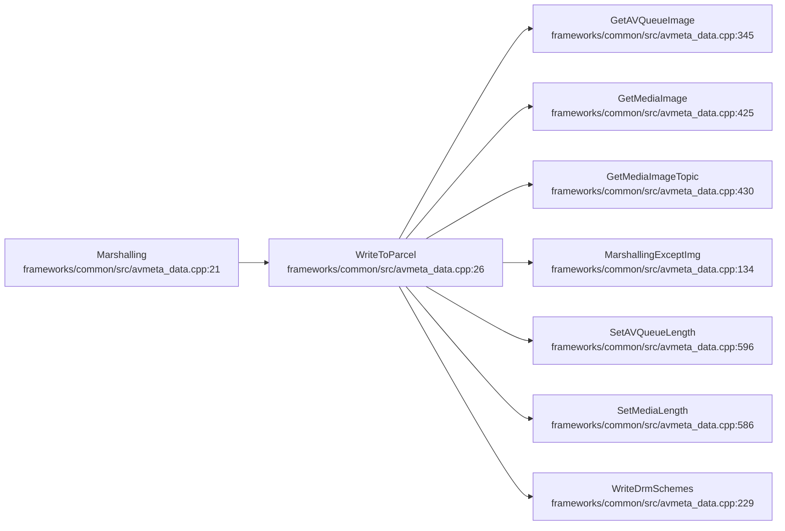
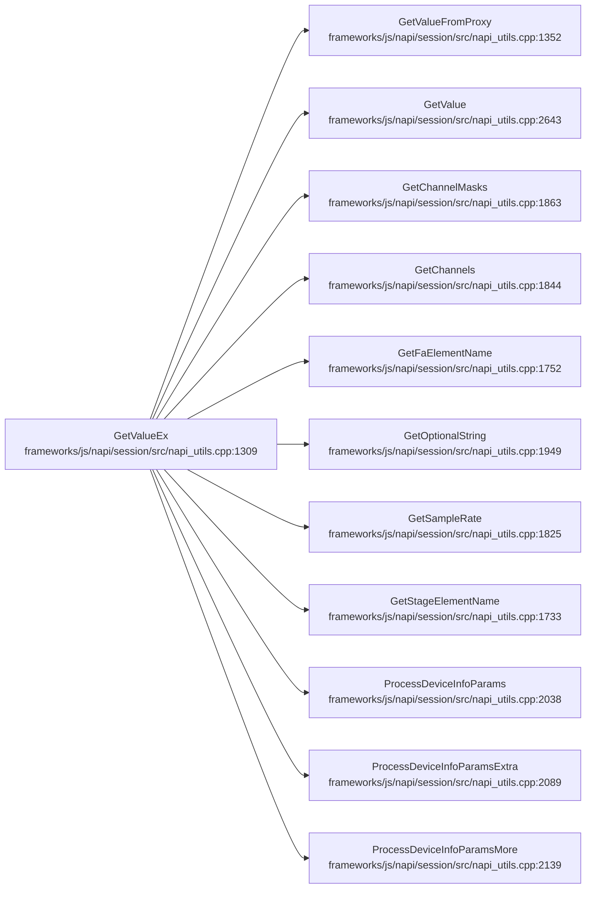
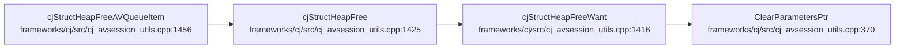
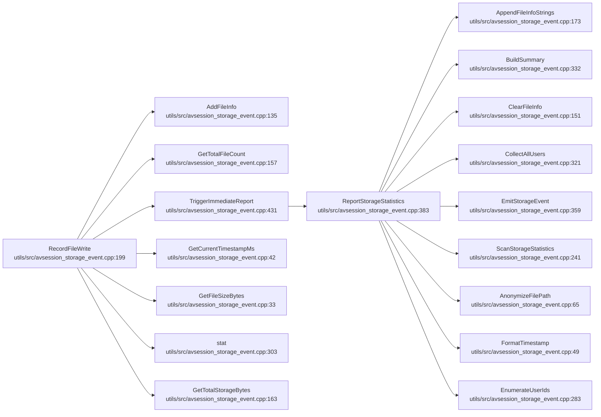

# 数据序列化生命周期

## 概述
本域覆盖 AVSession 的数据序列化与内存/IPC 边界操作：`Marshalling` 将 AVMetaData 写入 Parcel（含媒体图/队列图 buffer 拼装）；`GetValueEx` 在 napi 层把 JS 值转 `vector<double>`（TypedArray/Array/Proxy 三路）；`cjStructHeapFreeAVQueueItem` 释放 cj 侧 AVQueueItem 堆结构；`RecordFileWrite` 记录文件写入并在超限时触发存储统计上报。典型报错方向：序列化为内存/IPC 操作，**无 FAULT/SECURITY 级 HiSysEvent 上报**——错误以 `CHECK_AND_RETURN_RET_LOG`/`CHECK_RETURN` 返回 false 或 `napi_invalid_arg` 的形式体现（hilog）。唯一的 HiSysEvent 是 `RecordFileWrite→EmitStorageEvent` 上报的 `PLAYING_AVSESSION_STATS`（STATISTIC/CRITICAL，存储统计埋点）。

## 调用序列

### Marshalling (flow 40)

### GetValueEx (flow 41)

### cjStructHeapFreeAVQueueItem (flow 39)

### RecordFileWrite (flow 34)

## 逐步错误上报

### Marshalling (flow 40)
- **步骤**：`WriteToParcel (frameworks/common/src/avmeta_data.cpp:26)`
  - **上报**：无 HiSysEvent（仅 hilog）。
  - **错误条件**：:48 `parcel.WriteInt32(twoImageLength)` 失败 → `CHECK_AND_RETURN_RET_LOG(...false,"write twoImageLength failed")`；:49 `MarshallingExceptImg` 失败 → return false；:52 图片长度非法（`twoImageLength<=0` 或 `>10MB`）→ :54 直接 return true（跳过图片写入）；:56 `new unsigned char[]` 返回 nullptr → :57 `CHECK_AND_RETURN_RET_LOG(...false,"new buffer failed")`；:66 `WriteRawData` 失败 return 其值。
  - **file:line**：`frameworks/common/src/avmeta_data.cpp:48`/`:49`/`:57`/`:66`

### GetValueEx (flow 41)
- **步骤**：`GetValueEx (frameworks/js/napi/session/src/napi_utils.cpp:1309)`
  - **上报**：无 HiSysEvent（仅 hilog）。
  - **错误条件**：:1313 `napi_is_typedarray` 失败 → :1315 `CHECK_RETURN` 返回 status；:1323 `napi_get_typedarray_info` 失败 → :1325 返回 `napi_invalid_arg`；:1331 `napi_is_array` 失败 → :1333 返回 `napi_invalid_arg`；:1334 非 Array → 走 `GetValueFromProxy`；:1340/1343 取元素/转 double 失败 → `napi_invalid_arg`。
- **步骤**：`GetValueFromProxy (frameworks/js/napi/session/src/napi_utils.cpp:1352)`
  - **上报**：无。
  - **错误条件**：:1356 取 `length` 属性失败 return status；:1359 `napi_get_value_uint32` 失败 return status；:1361 空数组 return `napi_ok`；:1366/1368 取元素/转 double 失败 → `napi_invalid_arg`；:1372 长度不匹配（`out.size()!=len`）→ :1375 `SLOGE get array not complete`、清空返回 `napi_invalid_arg`。
  - **file:line**：`frameworks/js/napi/session/src/napi_utils.cpp:1375`

### cjStructHeapFreeAVQueueItem (flow 39)
- **步骤**：`cjStructHeapFreeAVQueueItem (frameworks/cj/src/cj_avsession_utils.cpp:1456)`
  - **上报**：无。
  - **错误条件**：:1459 `cjArrHead` 为 null 直接 return（无内存可释放）；:1460-1462 逐元素 `cjStructHeapFree`（`free` 各字符串字段并置 null），:1463 `free(cjArrHead)`。纯释放逻辑，无错误上报；`ClearParametersPtr:370` 清 Want 参数指针。
  - **file:line**：`frameworks/cj/src/cj_avsession_utils.cpp:1459`

### RecordFileWrite (flow 34)
- **步骤**：`RecordFileWrite (utils/src/avsession_storage_event.cpp:199)` → `TriggerImmediateReport:431` → `ReportStorageStatistics:383` → `EmitStorageEvent:359`
  - **上报**：`PLAYING_AVSESSION_STATS`（STATISTIC/CRITICAL，存储统计埋点）
  - **错误条件**：:210 `storageUserDataMap_.size()+totalFileRecords >= MAX_BUNDLE_NAMES` → :212 `TriggerImmediateReport` 立即上报；周期路径由 `Init→StartPeriodicReport` 定时触发（见 AVSession 域 flow 23）。`EmitStorageEvent:364` 写 `HISYSEVENT_STATISTIC("PLAYING_AVSESSION_STATS",...)`，`AVSESSION_CONTROL_BUNDLE_NAME` 为各用户 bundle 摘要。本域除该 STATISTIC 埧点外无 FAULT/SECURITY 级上报。
  - **file:line**：`utils/src/avsession_storage_event.cpp:364`

## 错误目录

| 事件名 | 类型 | 级别 | 触发流 | 上报 file:line | 错误条件 |
|---|---|---|---|---|---|
| PLAYING_AVSESSION_STATS | STATISTIC | CRITICAL | RecordFileWrite→EmitStorageEvent | utils/src/avsession_storage_event.cpp:364 | 存储 bundle 数超限立即上报/周期上报;本域无 FAULT/SECURITY 级,仅 STATISTIC 级埋点 |
<!-- ERR: PLAYING_AVSESSION_STATS | STATISTIC | CRITICAL | RecordFileWrite->EmitStorageEvent | utils/src/avsession_storage_event.cpp:364 | 存储 bundle 数超限立即上报/周期上报;本域无 FAULT/SECURITY 级,仅 STATISTIC 级埋点 -->

## 下钻锚点
- MetaData 序列化：`frameworks/common/src/avmeta_data.cpp:21`（Marshalling）/ `:26`（WriteToParcel）/ `:134`（MarshallingExceptImg）
- napi 值转换：`frameworks/js/napi/session/src/napi_utils.cpp:1309`（GetValueEx）/ `:1352`（GetValueFromProxy）
- cj 堆释放：`frameworks/cj/src/cj_avsession_utils.cpp:1456`（cjStructHeapFreeAVQueueItem）/ `:1425`（cjStructHeapFree）
- 存储统计上报：`utils/src/avsession_storage_event.cpp:199`（RecordFileWrite）/ `:431`（TriggerImmediateReport）/ `:359`（EmitStorageEvent）/ `:364`（PLAYING_AVSESSION_STATS 写入点）
