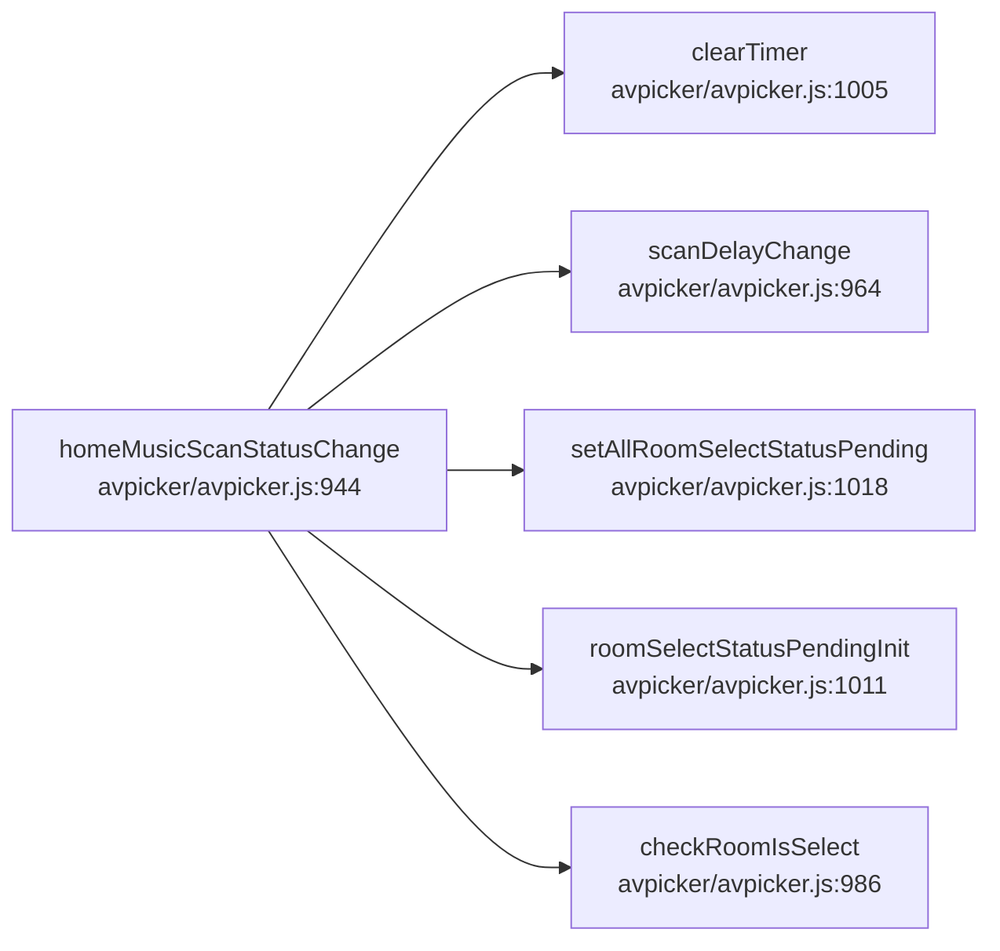
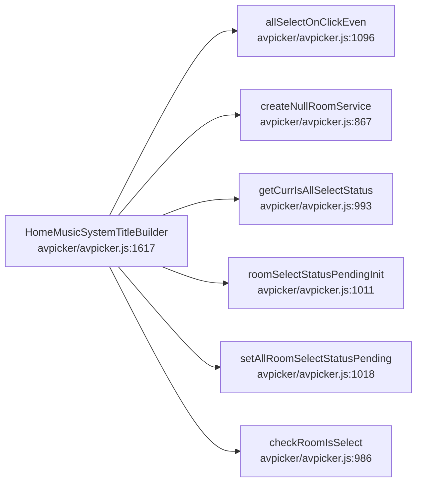
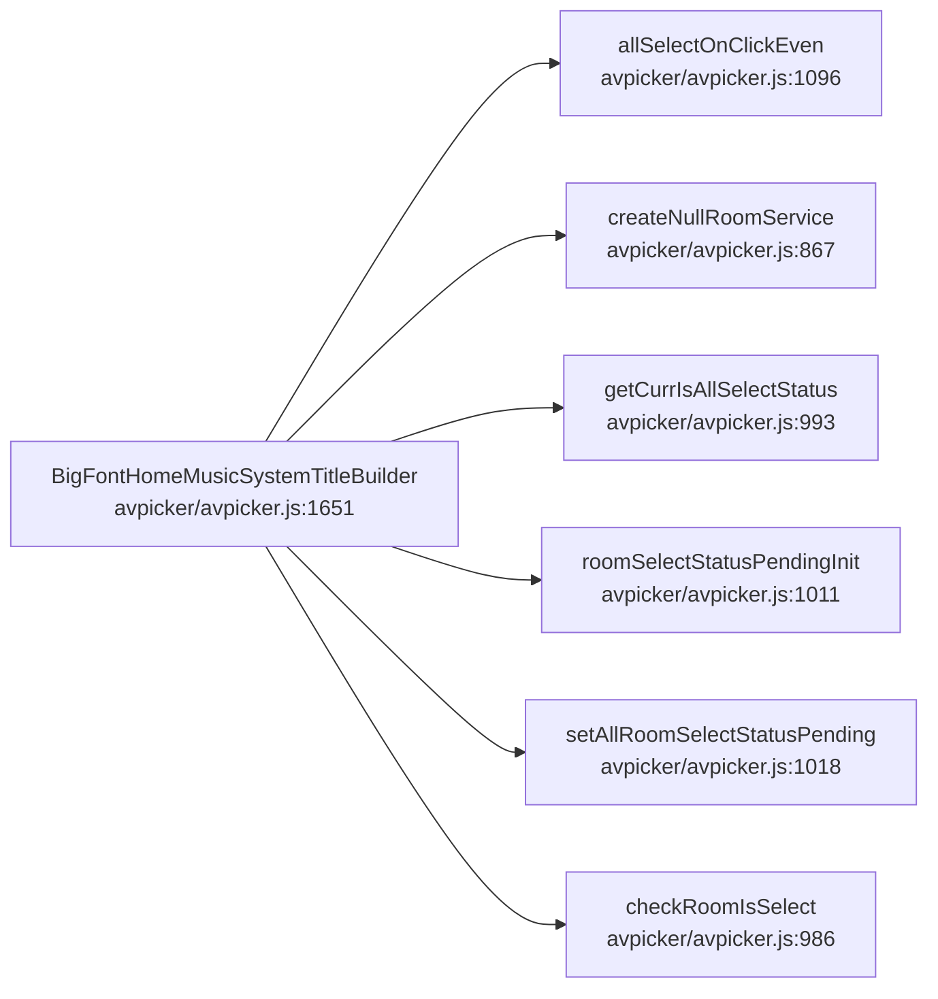
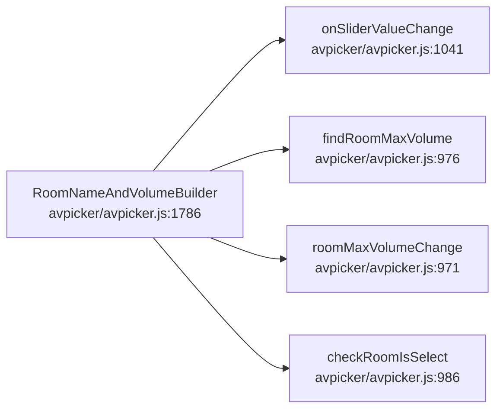

# 前端 UI 生命周期

## 概述
本域为 `avpicker/avpicker.js` 中 AVCastPicker 前端 UI 构建逻辑：`homeMusicScanStatusChange` 响应扫描状态变更并维护房间选中态；`HomeMusicSystemTitleBuilder`/`BigFontHomeMusicSystemTitleBuilder` 构建系统音乐标题（全选事件/空房间服务/全选状态）；`RoomNameAndVolumeBuilder` 构建房间名与音量滑块。典型报错方向：前端 JS 逻辑为本地状态计算，**无 HiSysEvent/hilog 上报**——错误以 JS 运行时异常或上游 napi 接口返回值（如 `napi_invalid_arg`）的形式体现，由调用方处理。本域无 FAULT/SECURITY 级 HiSysEvent 上报。

## 调用序列

### homeMusicScanStatusChange (flow 35)

### HomeMusicSystemTitleBuilder (flow 36)

### BigFontHomeMusicSystemTitleBuilder (flow 37)

### RoomNameAndVolumeBuilder (flow 38)

## 逐步错误上报
本域 4 条流均为 `avpicker/avpicker.js` 前端 JS 构建逻辑，全链路 **无 HiSysEvent / hilog 上报**（grep `HiSysEvent|HISYSEVENT|hilog` 在 `avpicker/avpicker.js` 无命中）。
- `homeMusicScanStatusChange`：清定时器/延迟扫描/置房间选中态，错误以未匹配的房间数据形式体现于 UI，无上报。
- `HomeMusicSystemTitleBuilder`/`BigFontHomeMusicSystemTitleBuilder`：全选点击/空房间服务/全选状态计算，无上报。
- `RoomNameAndVolumeBuilder`：滑块值变更/房间最大音量查找，无上报；若上游 `napi` 接口返回 `napi_invalid_arg`，由 `napi_utils.cpp`（见序列化域）侧返回，本域不产生日志。

## 错误目录

| 事件名 | 类型 | 级别 | 触发流 | 上报 file:line | 错误条件 |
|---|---|---|---|---|---|
| NONE | - | - | 前端 UI 生命周期 | - | 本域无 FAULT/SECURITY 级 HiSysEvent 上报(纯前端 JS 本地逻辑) |
<!-- ERR: NONE | - | - | 前端 UI 生命周期 | - | 本域无 FAULT/SECURITY 级 HiSysEvent 上报(纯前端 JS 本地逻辑) -->

## 下钻锚点
- 扫描状态变更：`avpicker/avpicker.js:944`（homeMusicScanStatusChange）
- 系统标题构建：`avpicker/avpicker.js:1617`（HomeMusicSystemTitleBuilder）/ `:1651`（BigFontHomeMusicSystemTitleBuilder）
- 房间名与音量：`avpicker/avpicker.js:1786`（RoomNameAndVolumeBuilder）
- 公共选中态：`avpicker/avpicker.js:986`（checkRoomIsSelect）/ `:1018`（setAllRoomSelectStatusPending）
